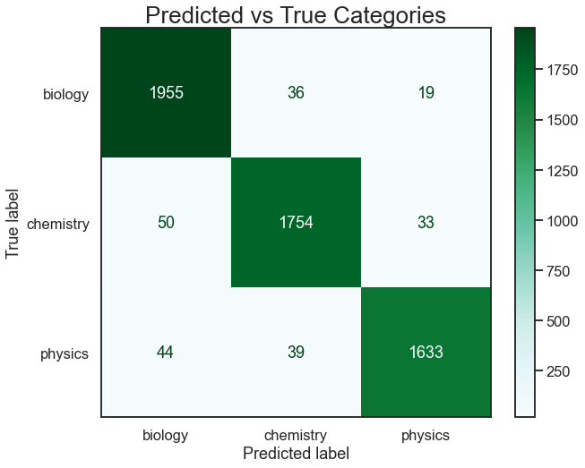
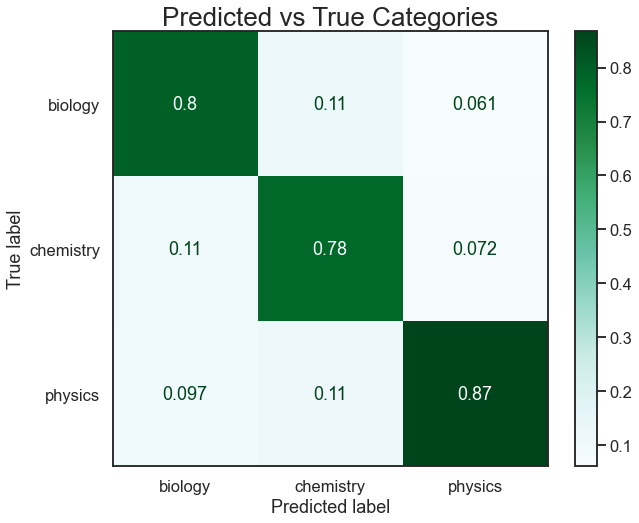

# Classification Models and Natural Language Processing

# Problem Statement
A useful application of machine learning is to extract information from text. In this project I train models to categorize text from scientific discussion forums on the site reddit.com into one of three categories: physics, chemistry, or biology. These "hard sciences" share much in common, but each have their own distinct areas of study and research. By training and optimizing a variety of models, my goal is to not only produce an effective classification model with natural language processing, but to better understand what challenges are found in this particular classification problem.

# Data Dictionary

Included in this repository are four spreadsheet files with data scraped from reddit using the pushshift api. This inludes 3 files containing data from the individual science subreddits and one file containing the testing data and model predictions.

|Feature|Data type|Data sets|Description|
|---|---|---|---|
|**id**|*string*|All Data|Submission identification number from reddit.com|
|**title**|*string*|All Data|Title text for the submission|
|**selftext**|*string*|All Data|Additional (optional) text included in each submission|
|**numcomments**|*int*|All Data|The number of comments a submission had at the time of data collection|
|**created_utc**|*string*|All Data|The time and date from when the submission was created (UTC)|
|**subreddit**|*string*|Subreddit Data|The subredddit from which each submission was scraped|
|**nb**|*int*|Prediction Data|The prediction of the Naive Bayes model: 0 for Biology; 1 for Chemistry; 2 for Physics|
|**svc**|*int*|Prediction Data|The prediction of the Linear SVC model: 0 for Biology; 1 for Chemistry; 2 for Physics|
|**ada**|*int*|Prediction Data|The prediction of the AdaBoost Classifier model: 0 for Biology; 1 for Chemistry; 2 for Physics|
|**vote**|*int*|Prediction Data|The final prediction of the ensemble of models: 0 for Biology; 1 for Chemistry; 2 for Physics|
|**y_true**|*int*|Prediction Data|Ordinal representation of "subreddit" feature, the actual values to compare against predictions|

# Executive Summary

For this problem, data was collected from user posts on the site reddit.com. Using pushshift api through jupyter notebook, 10,000 submissions were aqcuired from each of the target sections of the site, known as "subreddits." The subreddits chosen for this task were three science-related forums covering biology, chemistry, and physics. Using the information scraped from the site, submissions that had been removed from the subreddits (by subreddit moderators, site administrators, or anti-spam bots, for example) were dropped from the data. Although much information can be acquired by this method, this problem concerns the classification of text, so the text information was retained, along with some other very basic data, and the rest discarded. Exploration of the text from each subreddit showed distinct differences between commonly used words in each.

The data was joined into one dataframe and split into testing and training data. The text from the title and selftext columns were combined into one column for easier vectorization. Initial modeling used TfidVectorizer and Logistic Regression. The logistic regression model did not perform well with bigrams and trigrams. Early results from the Logistic Regression model correctly classified about 86% of submissions overall.

A bagging classifier using logistic regression models was fit with training data, but early results were slow to fit and did not perform better than early attempts at logistic regression. This could be because sufficient data was gathered, and that data was representative of the population. Thus, any benefit from bootstrapping would be very small, and optimization would be computationally expensive due to the size of the data. While the model was kept for consideration, it was not optimized further.

Other models which were tested include: Multinomial Naive Bayes, Decision Tree, Linear SVC, and AdaBoostClassifier. Kernal SVM was considered but was computationally slow and did not produce good predictions, too often favoring one class over the others even after shrinking and balancing testing data.  While SVC and Naive Bayes models did not produce optimal results from ngrams of n=2 or n=3, Decision Tree and AdaBoostClassifier were more effecient and made better predictions with features included bi or tri-grams. These models were less accurate than the other classifiers, but produced a somewhat different set of predictions, and were best at classifying the "physics" category.

After optimizing the varioius models, three were selected to 'vote' on final predictions. The three chosen were: Naive Bayes, Linear SVC, and AdaBoost Classifier. The combination of these three models outperformed other combinations when the final vote was compared to test target values. Logistic Regression and LinearSVC had extremely similar predictions, so both models could not be used together without negatively affecting accuracy. The three voting models had sufficiently different predictions that the combination of those three produced a result better than any one model considered.

# Visualizations

### Logistic Regression Confusion Matrix

### AdaBoost Confusion Matrix

Values are normalized to predictions - For example, when the model predicted chemistry, it was correctly classified 78% of the time, while the prediction actually belonged to physics 11% of the time and biology 11% of the time.

### Final Vote Confusion Matrix

# Conclusions

Although many scientific terms span more than one word, most models could not effectively use bi-grams or larger features. All gridsearches with these models produced optimal results with ngram_range set to (1,1), and stopwords set to 'none'. It is possible that stopwords used for most english text are not sufficient for scientific discussion. For better classification, it may be necessary to create a list of stopwords specific to scientific terminology. A better list of stopwords may allow more models to make use of larger n-gram features.

During post-modeling analysis, it was found that some misclassified posts were not able to be classified because they did not contain any relevant science discussion. Some of these were spam, others were 'community' types of discussions, and others were emojis or single-word titles with a link to youtube. This is an inherent problem with the data source and will always lead to classification errors. However, further modeling could attempt to pre-classify submissions as "relevant" or "not relevant" to science discussion, and thus the models above would only consider the most relevant submissions.

The accuracy of the model most likely suffered somewhat due to recent world events. COVID-19 has been a popular topic in the biology subreddit, but discussions have surfaced in both chemistry and physics as well. The models have misclassified many posts about the virus as belonging to 'biology' when in fact, they were posted in another subreddit. This is an example of how overlap occurs between scientific disciplines, and that can make categorization difficult even for humans.

# Resources

www.reddit.com

www.reddit.com/r/physics

www.reddit.com/r/biology

www.reddit.com/r/chemistry

https://pushshift.io